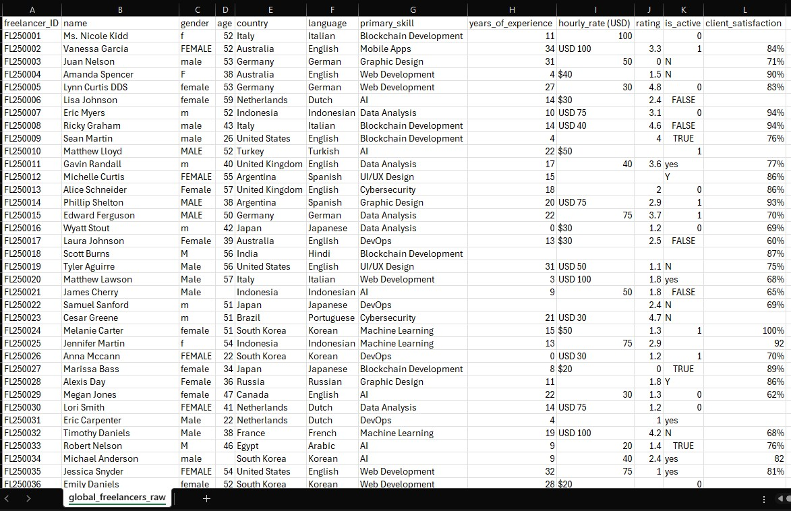
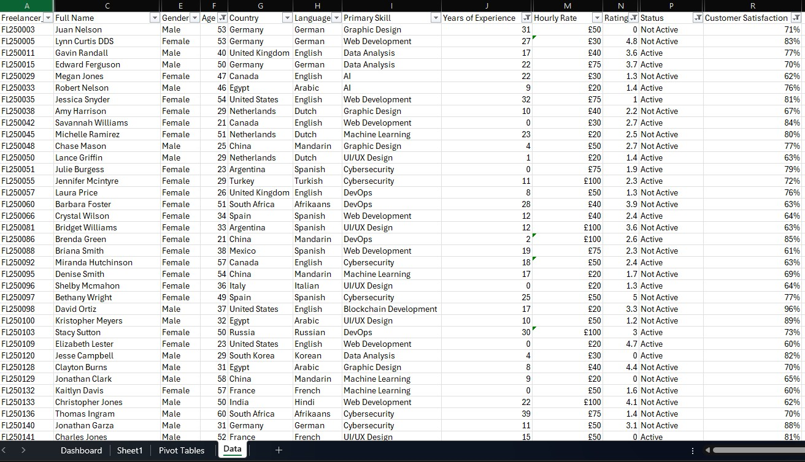
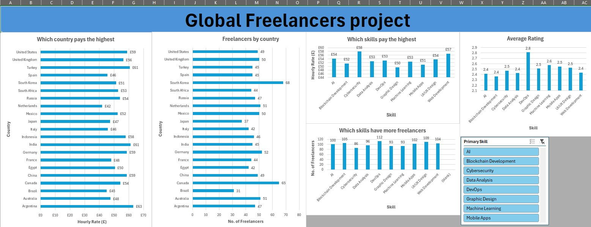

# Excel Dashboard – Global Freelancers Analysis

## 📌 Overview
This project analyses a global freelancers dataset using Excel, focusing on data cleaning, preparation, and dashboard creation. The final output is an interactive dashboard designed to communicate insights clearly to non-technical audiences.

## 🛠 Tools Used
- **Microsoft Excel**
- Pivot Tables
- Slicers
- Excel formulas

## 📊 Dataset
- ~1,000 freelancer records  
- Fields covering rates, experience level, skills, location, and customer satisfaction  

## 🔄 Project Workflow
1. Reviewed raw data and identified inconsistencies and missing values  
2. Cleaned and standardised the dataset for analysis  
3. Built pivot tables to analyse key metrics  
4. Created an interactive dashboard using slicers and charts  

## 📌 Key Insights
- Rate variations by experience level  
- Most common freelancer skills and associated rates  
- Relationship between experience, skills, and customer satisfaction  

## ✅ Skills Demonstrated
- Data cleaning and preparation in Excel  
- Pivot tables and slicers  
- Dashboard design and storytelling  
- Communicating insights to non-technical audiences

## 📂 Data Preparation

### Raw Data

### Cleaned Data

## 📈 Dashboard & Analysis

